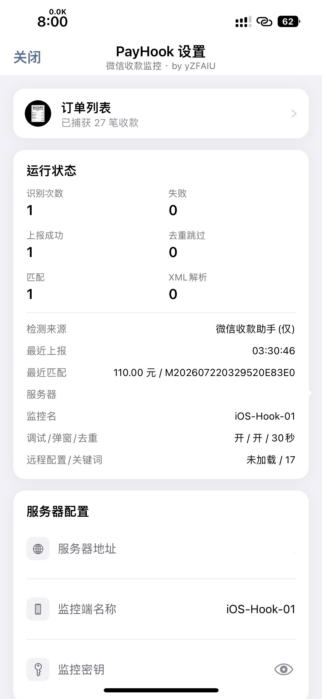

# PayHook_iOS — iOS 微信收款监控插件

Hook 微信消息接收，检测收款到账通知，自动提取金额并上报到 PayHook 服务端。

## 安装方式

无需越狱，二选一：

| 方式 | 环境 | 持久性 |
|------|------|--------|
| 巨魔 (TrollStore) | iOS 14-16.6.1 | 永久 |
| 自签证书注入 | 任意 iOS | 7 天续签 |

- **巨魔**：解密微信 IPA → `insert_dylib` 注入 → TrollStore 安装，一次永久
- **自签**：同上注入流程 → `azule` 打包 → 个人 Apple ID 签名 → AltStore/SideStore 安装

## 核心模块

| 模块 | 职责 |
|------|------|
| `Tweak.x` | 主控 + 6 组 CMessageMgr Hook + 收款识别 + HTTP 上报 |
| `XJPaymentXMLParser` | NSXMLParser 解析 `<wcpayinfo>` 获取 paysubtype/feedesc/transcationid |
| `XJRemoteConfig` | 远程 JSON 配置热更新 (关键词/正则/白名单) |
| `XJPaySourceConfig` | 公众号白名单 NSSet 查找 (O(1)) |
| `XJMessageDedup` | 基于 svrMsgId 的 LRU 消息去重 |

## 收款检测流程

```
消息到达 → svrMsgId 去重 → 白名单识别（仅「微信收款助手」）→ 金额提取 → HTTP 上报
```

仅识别来自「微信收款助手」公众号（`gh_f0a92aa7146c`）的消息，不再使用 XML/关键词/模糊匹配兜底，杜绝误判。

## 编译

```bash
cd PayHook_iOS
./build.sh        # 自动版本号递增: 3.0.0-{N}
```

需要 theos + Xcode iOS SDK。

## Hook 安全规则

- 不 hook `CMessageWrap.setM_nsContent:` (消息构造期间调用，对象不完整)
- 使用 6 组 CMessageMgr Hook fallback 兼容多版本微信
- 消息处理前检查 `fromUser != nil` 跳过未初始化对象

## 使用

微信 **我 → 设置** 连点标题 5 次打开控制面板。



> 面板可查看运行状态、最近上报/匹配记录、服务器地址、监控端名称与监控密钥等配置。
